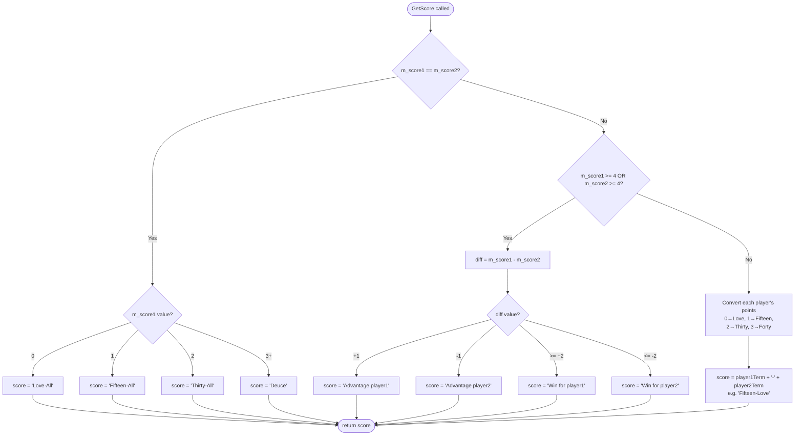

# TennisGame1 - `GetScore()` Explanation

## Code Explanation

The `GetScore()` method returns the current tennis score as a string, following standard tennis scoring terminology. It handles three distinct scenarios:

### 1. Equal Scores (`m_score1 == m_score2`)
When both players have the same score:
| Points | Result |
|--------|-------------|
| 0 | "Love-All" |
| 1 | "Fifteen-All" |
| 2 | "Thirty-All" |
| 3+ | "Deuce" |

### 2. Endgame (`m_score1 >= 4` or `m_score2 >= 4`)
When at least one player has 4+ points, the difference determines the result:
| Difference (p1 - p2) | Result |
|-----------------------|------------------------|
| +1 | "Advantage player1" |
| -1 | "Advantage player2" |
| >= +2 | "Win for player1" |
| <= -2 | "Win for player2" |

### 3. Normal Scoring (scores differ, both < 4)
Each player's numeric score is converted to a tennis term (`0→Love`, `1→Fifteen`, `2→Thirty`, `3→Forty`) and joined with a hyphen. Example: `"Fifteen-Love"`, `"Thirty-Forty"`.

---

## Flowchart

